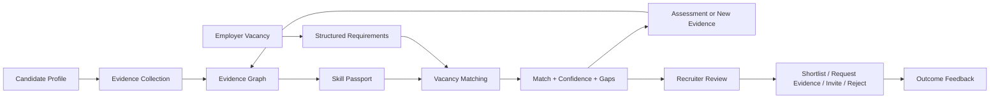

# BeyondResume — Unified Product, Business and Technical Specification

**Версия:** 3.0  
**Статус:** Draft for Product Approval  
**Дата:** 17 июля 2026  
**Язык реализации MVP:** русский интерфейс с готовностью к i18n  
**Назначение:** единый источник требований для продукта, дизайна, frontend, backend, AI, аналитики, монетизации и дальнейших этапов разработки.

---

## 0. Правила использования документа

Этот документ заменяет разрозненные продуктовые решения и становится основным источником истины для BeyondResume.

Документ определяет:

- какую проблему решает продукт;
- кто является пользователем, покупателем и плательщиком;
- как устроен полный жизненный цикл кандидата и работодателя;
- какие данные являются доказательствами навыков;
- как формируются Skill Passport, Match Score и Confidence Score;
- какие решения разрешено принимать AI;
- какие функции входят в Hackathon MVP, Commercial MVP и последующие версии;
- как продукт монетизируется;
- какие ограничения, тарифы и usage-события должны поддерживаться сайтом;
- какие API, таблицы, страницы и статусы должны существовать;
- какие метрики определяют успех продукта.

### 0.1 Нормативные термины

- **MUST** — обязательное требование.
- **MUST NOT** — запрещённое поведение.
- **SHOULD** — рекомендуемое требование, которое допускается отложить только с явным решением.
- **MAY** — опциональная функция.
- **Hackathon MVP** — демонстрационная end-to-end версия.
- **Commercial MVP** — первая версия, которую можно продавать реальным компаниям.
- **Post-MVP** — функции, которые не должны блокировать запуск.

### 0.2 Приоритет требований

При конфликте требований применяется следующий порядок:

1. безопасность, законность и права кандидата;
2. детерминированность и объяснимость scoring;
3. целостность данных;
4. продуктовая бизнес-логика;
5. коммерческая логика и ограничения тарифов;
6. UX;
7. техническая оптимизация.

### 0.3 Запрет на самостоятельное расширение бизнес-логики

Разработчик или AI-ассистент MUST NOT:

- придумывать новые формулы scoring;
- добавлять скрытые штрафы;
- использовать защищённые характеристики;
- автоматически отклонять кандидатов;
- менять тарифные ограничения;
- вводить новые роли;
- добавлять платные ограничения кандидату;
- менять жизненные циклы сущностей;
- перестраивать архитектуру без изменения этого документа.

Недоопределённое поведение должно быть вынесено на уточнение, а не реализовано по предположению.

---

# Часть I. Продукт и рынок

## 1. Название и категория продукта

**Название:** BeyondResume  
**Категория:** Evidence-Based Talent Intelligence для найма junior IT-специалистов.

BeyondResume не является:

- конструктором резюме;
- обычным job board;
- полноценной ATS в первой версии;
- автоматическим судьёй кандидатов;
- платформой, где LLM самостоятельно принимает решение о найме.

BeyondResume является слоем оценки качества сигнала между входящим потоком кандидатов и решением рекрутера.

## 2. Проблема

### 2.1 Проблема кандидата

У junior-кандидата недостаточно формального опыта, поэтому обычное резюме слабо отражает его реальную готовность к работе.

Полезные доказательства часто разбросаны по разным источникам:

- резюме;
- GitHub;
- pet-проекты;
- учебные проекты;
- стажировки;
- сертификаты;
- хакатоны;
- open-source contributions;
- технические задания;
- рекомендации.

Кандидат не понимает:

- какие навыки действительно подтверждены;
- какие навыки только заявлены;
- на какие вакансии он подходит сейчас;
- почему он не проходит первичный отбор;
- какие действия сильнее всего повысят его готовность.

### 2.2 Проблема работодателя

Работодатель получает большое количество junior-резюме с похожими формулировками и не может быстро определить реальный уровень кандидатов.

Ручная проверка требует:

- открыть резюме;
- проверить ссылки;
- просмотреть GitHub;
- оценить проекты;
- проверить соответствие вакансии;
- сформировать вопросы для интервью.

В результате:

- screening занимает много времени;
- хорошие кандидаты теряются из-за слабого оформления;
- красивые self-claims получают слишком высокий вес;
- hiring managers повторяют одну и ту же проверку;
- решение сложно объяснить и защитить.

### 2.3 Экономическая проблема

Экономический ущерб создаётся не только неправильным наймом, но и стоимостью первичной обработки потока:

- часы рекрутера и hiring manager;
- задержка закрытия вакансии;
- стоимость внешних assessment-инструментов;
- повторная работа при слабом shortlist;
- потеря подходящих кандидатов;
- плохой candidate experience.

BeyondResume должен продавать не «AI-анализ резюме», а сокращение стоимости и времени первичного отбора при сохранении человеческого контроля.

## 3. Миссия

> BeyondResume помогает компаниям оценивать начинающих IT-специалистов по проверяемым доказательствам навыков, а кандидатам — понимать и закрывать конкретные пробелы до желаемой роли.

## 4. Ценностное предложение

### 4.1 Для кандидата

BeyondResume превращает разрозненные достижения в единый Skill Passport и показывает:

- подтверждённые навыки;
- силу доказательств;
- соответствие конкретным вакансиям;
- критические пробелы;
- следующий наиболее полезный шаг;
- изменение результата после нового evidence или assessment.

### 4.2 Для работодателя

BeyondResume превращает поток резюме в объяснимый shortlist:

- ранжирование по требованиям вакансии;
- отдельный Match Score и Confidence Score;
- подтверждения по каждому навыку;
- критические gaps;
- причины высокого или низкого результата;
- возможность запросить дополнительное доказательство;
- история действий и human decision.

### 4.3 Одно предложение для продаж

> BeyondResume сокращает время первичного отбора junior IT-кандидатов, превращая резюме, GitHub и проекты в объяснимый профиль навыков и сопоставляя его с требованиями вакансии.

## 5. Продуктовые принципы

1. **Evidence over assertion.** Подтверждение сильнее self-claim.
2. **Human-in-the-loop.** Система помогает принимать решение, но не нанимает и не отклоняет автоматически.
3. **Explainability by default.** Каждое число должно раскрываться до факторов и evidence.
4. **Missing data is uncertainty, not incompetence.** Отсутствие данных снижает confidence, но не является доказательством слабого уровня.
5. **Deterministic final scoring.** Финальные числа вычисляет backend по версионированным формулам.
6. **AI as extraction layer.** AI извлекает, классифицирует и объясняет, но не устанавливает бизнес-правила.
7. **Candidate transparency.** Кандидат видит, какие данные используются и может исправить ошибку.
8. **Minimal sensitive data.** Защищённые характеристики не используются в scoring.
9. **Commercial discipline.** Платформа должна измерять usage, стоимость обработки и полученную клиентом ценность.
10. **Integration, not replacement.** Коммерческая версия сначала дополняет ATS, а не пытается заменить её.

---

# Часть II. Пользователи, роли и доступ

## 6. Роли

### 6.1 Candidate

Candidate может:

- зарегистрироваться;
- редактировать профиль;
- загружать резюме;
- подключать evidence sources;
- запускать анализ;
- видеть Skill Passport;
- видеть match по доступным вакансиям;
- проходить assessments;
- получать roadmap;
- управлять видимостью профиля;
- отзывать согласие и удалять данные;
- оспаривать неверно извлечённое evidence.

Candidate MUST NOT видеть:

- закрытые заметки рекрутера;
- других кандидатов;
- внутренний ranking работодателя;
- конфиденциальные настройки вакансии.

### 6.2 Employer Member / Recruiter

Recruiter может:

- работать внутри одной или нескольких организаций, к которым приглашён;
- создавать и редактировать вакансии в рамках прав;
- просматривать кандидатов только в контексте вакансий организации;
- видеть Match, Confidence и evidence explanations;
- добавлять кандидата в shortlist;
- запрашивать дополнительное evidence;
- отправлять приглашение;
- фиксировать этапы hiring pipeline;
- оставлять внутренние заметки.

Recruiter MUST NOT:

- просматривать весь глобальный каталог кандидатов без разрешения кандидатов и соответствующего тарифа;
- видеть защищённые характеристики;
- экспортировать больше данных, чем разрешает тариф и политика;
- автоматически отклонять кандидата только по score.

### 6.3 Company Admin

Company Admin имеет права Recruiter и дополнительно может:

- управлять организацией;
- приглашать и удалять участников;
- назначать роли;
- управлять подпиской;
- видеть usage и billing;
- управлять API keys и интеграциями;
- управлять retention policy в разрешённых пределах;
- экспортировать audit data.

### 6.4 Platform Admin

Platform Admin существует только для эксплуатации сервиса.

Он может:

- просматривать технические статусы;
- управлять тарифами через административную конфигурацию;
- просматривать агрегированную аналитику;
- обрабатывать запросы поддержки;
- блокировать злоупотребления;
- запускать повторную обработку jobs.

Platform Admin MUST NOT изменять Match Score вручную без audit event и явной причины.

### 6.5 Будущие роли

Следующие роли не входят в Hackathon MVP:

- Agency Admin;
- University Admin;
- Mentor;
- Auditor;
- Integration Service Account.

Они могут быть добавлены только после расширения этой спецификации.

## 7. Организации и tenancy

Commercial MVP MUST поддерживать multi-tenant модель.

Основные правила:

- каждый работодатель действует внутри `organization`;
- пользователь может состоять в нескольких организациях;
- вакансия принадлежит ровно одной организации;
- billing account принадлежит организации;
- usage считается на уровне организации;
- кандидаты не принадлежат работодателю;
- application связывает кандидата и вакансию;
- данные одной организации не должны быть доступны другой;
- все employer API обязаны проверять membership и permission.

Hackathon MVP MAY использовать упрощённую модель, где employer profile фактически соответствует одной организации, но новая схема не должна блокировать переход к multi-tenant.

---

# Часть III. Основная бизнес-логика

## 8. Главный продуктовый цикл



## 9. Жизненный цикл кандидата

### 9.1 Регистрация

Candidate регистрируется по email и паролю.

После регистрации:

- создаётся user;
- создаётся candidate profile;
- onboarding status = `profile_required`;
- профиль не публикуется автоматически;
- marketing consent не включается по умолчанию.

### 9.2 Onboarding

Минимальные поля:

- display name;
- target role;
- location или remote preference;
- English level;
- availability;
- короткий summary;
- consent на обработку данных.

Необязательные поля:

- salary expectation;
- preferred employment type;
- relocation readiness;
- portfolio URL;
- LinkedIn URL.

### 9.3 Загрузка резюме

Кандидат загружает PDF или DOCX.

После успешной загрузки:

1. создаётся Resume;
2. создаётся Job типа `resume_parse`;
3. статус Resume = `uploaded`;
4. файл сохраняется неизменённым;
5. parsing выполняется асинхронно;
6. при успехе Resume = `parsed`;
7. при неуспехе Resume = `failed`;
8. ошибка должна быть понятна пользователю и пригодна для повторной попытки.

### 9.4 Evidence collection

После parsing система извлекает потенциальные claims:

- skills;
- projects;
- experience;
- education;
- certificates;
- achievements;
- links.

Каждый claim из резюме первоначально является `self_claimed`, пока не связан с более сильным evidence.

Кандидат может добавить:

- публичный GitHub repository;
- GitHub profile;
- project URL;
- certificate URL или файл;
- hackathon participation;
- assessment submission;
- work sample;
- reference.

### 9.5 Анализ профиля

Кнопка **Analyze profile** доступна, когда:

- есть успешно распарсенное резюме;
- пользователь принял обязательные согласия;
- нет активного анализа того же snapshot;
- не превышены ограничения защиты от злоупотреблений.

После запуска:

1. создаётся immutable profile snapshot;
2. создаётся analysis job;
3. собираются источники evidence;
4. AI извлекает и нормализует сущности;
5. deterministic validators проверяют структуру;
6. строится Evidence Graph;
7. backend рассчитывает skill scores и confidence;
8. создаётся версия Skill Passport;
9. активные match results пересчитываются;
10. usage event фиксируется.

### 9.6 Skill Passport

Кандидат получает:

- target role;
- список skills;
- уровень каждого skill;
- confidence;
- evidence strength;
- источники;
- дату последнего подтверждения;
- статус `claimed`, `supported`, `verified` или `assessed`;
- профильные strengths;
- области неопределённости;
- completeness score.

### 9.7 Поиск и match вакансий

Кандидат может:

- открыть опубликованную вакансию;
- увидеть eligibility;
- запустить match, если он ещё не рассчитан;
- увидеть Match Score;
- увидеть Confidence Score;
- увидеть critical gaps;
- увидеть рекомендованные действия.

Кандидат не должен видеть внутренние веса, которые работодатель пометил confidential, но должен видеть понятное объяснение причины результата.

### 9.8 Assessment

Assessment может быть:

- системным шаблоном;
- заданием работодателя;
- рекомендованным заданием для закрытия gap.

В Hackathon MVP поддерживается одно текстовое задание с отправкой GitHub URL и explanation.

После submission:

1. выполняются deterministic checks;
2. AI выполняет rubric review в пределах рубрики;
3. backend рассчитывает assessment result;
4. assessment evidence добавляется в Evidence Graph;
5. Skill Passport и Match пересчитываются;
6. кандидат видит `before` и `after`.

Пользовательский код в MVP MUST NOT исполняться.

### 9.9 Roadmap

Roadmap строится из 3–5 действий.

Каждое действие содержит:

- gap;
- причину важности;
- конкретный deliverable;
- ориентировочную сложность;
- ожидаемый эффект на readiness;
- способ доказать выполнение.

Roadmap не должен обещать гарантированный рост score, если результат зависит от качества будущего evidence.

### 9.10 Видимость профиля

Возможные статусы:

- `private` — доступен только кандидату;
- `applications_only` — виден работодателям, куда кандидат откликнулся;
- `discoverable` — может быть найден работодателями в разрешённых сценариях;
- `paused` — скрыт из discovery, существующие applications сохраняются.

По умолчанию: `applications_only`.

## 10. Жизненный цикл работодателя

### 10.1 Регистрация и организация

Employer регистрируется и:

- создаёт organization или принимает приглашение;
- подтверждает email;
- указывает company name, website, size и country;
- назначается Company Admin при создании организации;
- получает trial или free sandbox, если он предусмотрен pricing policy.

### 10.2 Trial

Рекомендуемая коммерческая политика:

- 14 дней;
- одна опубликованная вакансия;
- до 50 анализов кандидатов;
- до 2 seats;
- без API;
- без bulk export;
- карта не обязательна для design partners и pilot;
- карта может быть обязательной для публичного self-serve trial после доказанного PMF.

Trial превращается в paid только по явному согласию.

### 10.3 Создание вакансии

Вакансия создаётся в статусе `draft`.

Обязательные поля:

- title;
- role family;
- seniority;
- description;
- employment type;
- location/remote policy;
- language requirements;
- at least one must-have requirement;
- application visibility;
- status.

Каждое требование содержит:

- normalized skill или constraint;
- category;
- requirement type: `must_have`, `nice_to_have`, `constraint`;
- target level;
- weight;
- hard filter flag;
- evidence expectation;
- recruiter explanation.

### 10.4 Нормализация вакансии

Работодатель может вставить текст вакансии.

AI может предложить:

- skills;
- уровни;
- must-have/nice-to-have;
- constraints;
- дубли;
- слишком общие требования.

Но работодатель обязан подтвердить структуру перед публикацией.

### 10.5 Публикация вакансии

Публикация разрешена, если:

- organization active;
- subscription допускает новую active vacancy;
- обязательные поля заполнены;
- есть must-have;
- веса валидны;
- запрещённые критерии отсутствуют;
- recruiter подтвердил требования.

После публикации:

- vacancy status = `published`;
- открывается приём applications;
- существующие подходящие кандидаты MAY быть рассчитаны в background;
- usage учитывается только при фактическом анализе кандидата, а не при создании пустой вакансии.

### 10.6 Работа с кандидатами

Recruiter видит таблицу:

- candidate;
- Match Score;
- Confidence Score;
- critical gaps;
- top evidence;
- application stage;
- last updated;
- flags requiring human review.

Сортировка по умолчанию:

1. eligibility;
2. Match Score descending;
3. Confidence Score descending;
4. updated_at descending.

Система MUST NOT скрывать кандидата автоматически из-за низкого score. Допускается фильтр, который recruiter включает вручную.

### 10.7 Действия рекрутера

Поддерживаемые действия:

- open profile;
- shortlist;
- request evidence;
- invite;
- move stage;
- reject with reason;
- restore;
- add note.

Для adverse action система должна сохранить:

- кто принял решение;
- когда;
- reason category;
- optional comment;
- model/scoring version;
- score snapshot;
- confirmation, что решение принято человеком.

### 10.8 Закрытие вакансии

Возможные причины:

- hired;
- cancelled;
- paused;
- duplicate;
- budget closed.

После закрытия:

- новые applications запрещены;
- billing не должен считать вакансию active;
- история и audit сохраняются;
- retention policy применяется по договору и законодательству.

## 11. Application lifecycle

Статусы application:

- `submitted`;
- `screening`;
- `evidence_requested`;
- `shortlisted`;
- `assessment`;
- `interview`;
- `offer`;
- `hired`;
- `rejected`;
- `withdrawn`;
- `archived`.

Правила:

- переходы фиксируются в application events;
- кандидат может withdraw;
- employer не может вернуть withdrawn application без согласия кандидата;
- rejected можно restore только с audit event;
- hired завершает активный pipeline;
- изменение score не должно автоматически менять stage.

---

# Часть IV. Evidence Graph и Skill Passport

## 12. Evidence как основная единица продукта

### 12.1 Evidence Unit

Каждый evidence unit содержит:

- `id`;
- `candidate_id`;
- `source_type`;
- `source_reference`;
- `title`;
- `description`;
- `observed_at`;
- `issued_at`;
- `freshness_at`;
- `verification_status`;
- `ownership_status`;
- `strength_score`;
- `quality_flags`;
- `raw_payload_reference`;
- `created_at`;
- `updated_at`.

### 12.2 Источники evidence

| Source | Базовая сила | Комментарий |
|---|---:|---|
| Technical assessment | 1.00 | Сильное evidence при валидной рубрике |
| Relevant public code repository | 1.00 | Требуется ownership и содержательный код |
| Verified work sample | 0.95 | Проверяемый артефакт реальной работы |
| Work experience with explicit stack | 0.90 | Сильнее при внешнем подтверждении |
| Detailed project with repository/demo | 0.80 | Зависит от сложности и ownership |
| Hackathon result | 0.70 | Сильнее при публичной проверке |
| Certificate from recognized issuer | 0.50 | Подтверждает обучение, не обязательно практику |
| Course completion | 0.40 | Слабый сигнал без практического артефакта |
| Resume claim only | 0.30 | Self-claim без внешнего подтверждения |

Эти значения являются default configuration v1, а не вечными константами. Изменение требует новой scoring version.

### 12.3 Verification status

- `unverified`;
- `source_reachable`;
- `ownership_confirmed`;
- `issuer_verified`;
- `platform_assessed`;
- `disputed`;
- `invalidated`.

### 12.4 Skill claim

Skill claim связывает:

- candidate;
- normalized skill;
- source evidence;
- extracted context;
- claimed level;
- detected level;
- confidence;
- extraction version.

Один evidence unit может подтверждать несколько skills.

Один skill может подтверждаться несколькими independent evidence units.

## 13. Skill ontology

Система должна нормализовать варианты:

- `Postgres`, `PostgreSQL`, `postgresql` → `PostgreSQL`;
- `JS`, `JavaScript` → `JavaScript`;
- `REST`, `REST API`, `RESTful API` → skill family с контекстом.

Skill содержит:

- canonical name;
- aliases;
- category;
- parent skill;
- related skills;
- deprecated flag;
- version.

Категории MVP:

- programming_language;
- framework;
- database;
- tooling;
- testing;
- architecture;
- cloud_devops;
- computer_science;
- communication;
- language;
- domain.

## 14. Skill level

Уровень хранится в диапазоне 0–4:

- 0 — нет evidence;
- 1 — знакомство / guided use;
- 2 — самостоятельное применение в небольшом проекте;
- 3 — уверенное применение в комплексной задаче;
- 4 — продвинутое применение, системное понимание или leadership.

Для junior product большинство релевантных результатов ожидаются в диапазоне 1–3.

AI может предложить level estimate, но backend применяет правила ограничения по типу evidence.

Пример:

- resume self-claim не может самостоятельно дать итоговый level выше 1;
- один учебный проект не может самостоятельно дать level выше 2;
- verified assessment может подтвердить level до границы рубрики;
- несколько независимых сильных sources могут повысить level.

## 15. Candidate Skill Score

Для skill `s` рассчитываются:

- `level_score` 0–100;
- `evidence_strength` 0–100;
- `confidence` 0–100;
- `freshness` 0–100;
- `consistency` 0–100.

Базовая версия формулы:

```text
candidate_skill_score =
    0.45 * level_score
  + 0.25 * evidence_strength
  + 0.15 * freshness
  + 0.15 * consistency
```

Confidence рассчитывается отдельно и не умножается скрыто на skill score.

### 15.1 Aggregation evidence strength

Для предотвращения простого суммирования слабых источников применяется diminishing returns.

```text
combined_strength = 100 * (1 - Π(1 - adjusted_source_strength_i))
```

Где source strength приведён к диапазону 0–1 и скорректирован на:

- verification;
- ownership;
- relevance;
- freshness;
- duplication.

Дублированные или зависимые источники не считаются полностью независимыми.

## 16. Confidence Score навыка

```text
skill_confidence =
    0.30 * source_diversity
  + 0.25 * evidence_quality
  + 0.15 * extraction_certainty
  + 0.15 * freshness
  + 0.15 * cross_source_consistency
```

Интерпретация:

- 0–39 — low confidence;
- 40–69 — medium confidence;
- 70–84 — high confidence;
- 85–100 — very high confidence.

## 17. Skill Passport

### 17.1 Версионирование

Skill Passport является immutable snapshot.

Каждая версия содержит:

- profile snapshot id;
- evidence snapshot id;
- skill ontology version;
- scoring version;
- AI extraction version;
- generated_at;
- status;
- summary;
- completeness;
- skills.

Новый evidence создаёт новую версию, а не меняет старую историю.

### 17.2 Completeness Score

Completeness не является оценкой способностей.

Он показывает полноту информации:

- profile fields;
- resume;
- at least one project;
- at least one code source;
- contact/availability;
- recent evidence;
- target role.

Completeness отображается кандидату и может использоваться как подсказка, но MUST NOT напрямую повышать Match Score.

### 17.3 Статусы skill

- `claimed` — только self-claim;
- `supported` — есть дополнительное evidence;
- `verified` — источник/ownership проверен;
- `assessed` — подтверждён platform assessment;
- `disputed` — кандидат оспорил результат;
- `stale` — evidence устарело.

---

# Часть V. Vacancy Matching

## 18. Requirement model

Каждое vacancy requirement содержит:

- skill_id или constraint type;
- requirement_type;
- target_level;
- weight;
- hard_filter;
- minimum_confidence;
- accepted_evidence_types;
- explanation;
- display_order.

### 18.1 Weight rules

- сумма весов must-have внутри категории нормализуется;
- сумма весов nice-to-have нормализуется отдельно;
- employer может выбирать пресеты;
- employer не может задать отрицательный вес;
- employer не может использовать protected attribute;
- система предупреждает о нереалистичных junior requirements.

## 19. Eligibility

Eligibility проверяет только жёсткие constraints:

- legal work authorization, если законно и необходимо;
- location/remote compatibility;
- availability;
- required language;
- mandatory schedule;
- explicit hard skill only when employer подтверждает его как реальный hard filter.

Результаты:

- `eligible`;
- `conditionally_eligible`;
- `not_eligible`;
- `unknown`.

Unknown не равен not eligible.

## 20. Match Score

### 20.1 Базовая формула v1

```text
base_match =
    0.35 * must_have_coverage
  + 0.15 * nice_to_have_coverage
  + 0.20 * evidence_strength
  + 0.15 * project_relevance
  + 0.10 * recency_and_learning_velocity
  + 0.05 * role_constraints_fit
```

Итог:

```text
match_score = clamp(base_match - penalties, 0, 100)
```

### 20.2 Компоненты

**Must-have coverage** учитывает:

- наличие skill;
- target level;
- candidate skill score;
- confidence;
- requirement weight.

**Nice-to-have coverage** является бонусной частью и не должна компенсировать полностью отсутствие критического must-have.

**Evidence strength** показывает качество подтверждений именно для требований этой вакансии.

**Project relevance** определяется по совпадению технологий, задач и сложности проектов с контекстом роли.

**Recency and learning velocity** учитывает свежесть evidence и скорость появления новых подтверждений, но не должен дискриминировать людей с перерывами.

**Role constraints fit** учитывает только законные операционные ограничения.

### 20.3 Hard must-have cap

Если отсутствует обязательный hard must-have и работодатель явно подтвердил hard filter:

```text
match_score <= 59
```

В интерфейсе должно быть написано, какой критерий вызвал cap.

### 20.4 Penalties

| Причина | Диапазон |
|---|---:|
| Противоречивые данные | 0…-15 |
| Низкая проверяемость критического claim | 0…-10 |
| Ownership unresolved | 0…-10 |
| Подтверждённый spam/fraud pattern | 0…-20 |

Penalty MUST:

- иметь reason code;
- быть видимым в explanation;
- не основываться на защищённых характеристиках;
- быть оспоримым;
- сохраняться в audit trail.

### 20.5 Match bands

- 85–100 — strong match;
- 70–84 — promising match;
- 55–69 — partial match;
- 0–54 — significant gaps.

Bands не являются решением о найме.

## 21. Match Confidence

Match Confidence отражает качество данных для конкретной вакансии.

```text
match_confidence = weighted_average(
  confidence_of_required_skills,
  requirement_coverage,
  source_diversity,
  vacancy_definition_quality,
  extraction_certainty
)
```

Высокий Match при низком Confidence должен отображаться как требующий дополнительной проверки.

Пример:

- Match 82, Confidence 38 → перспективно, но мало подтверждений;
- Match 78, Confidence 91 → немного ниже score, но результат устойчивее.

## 22. Explainability

Каждый match result должен включать:

- top strengths;
- critical gaps;
- matched requirements;
- unmatched requirements;
- score contributions;
- confidence reasons;
- penalties;
- next best evidence;
- scoring version.

Пример:

```text
Match 82 / Confidence 71

Strengths
+ Python: resume + GitHub + project
+ FastAPI: confirmed in two repositories
+ PostgreSQL: confirmed in one relevant project

Gaps
- Docker: claimed but not confirmed
- Testing: insufficient verifiable evidence

Next action
Add tests and Docker setup to one existing project or complete the recommended assessment.
```

AI может превратить deterministic breakdown в читаемый текст, но не может изменить значения.

## 23. Skill Gaps

Gap содержит:

- requirement;
- current state;
- target state;
- severity;
- evidence missing vs skill missing;
- recommended action;
- estimated effort band;
- expected score influence band;
- verification method.

Критически важно различать:

- **skill gap** — навык действительно не обнаружен;
- **evidence gap** — навык заявлен, но плохо подтверждён;
- **confidence gap** — данные противоречивы или устарели;
- **constraint gap** — несовместимость по операционному требованию.

---

# Часть VI. AI и автоматизация

## 24. Разрешённая роль AI

AI MAY:

- извлекать структурированные данные из резюме;
- нормализовать названия skills;
- классифицировать project context;
- определять предполагаемую релевантность evidence;
- предлагать структуру вакансии;
- писать объяснение на основе готового breakdown;
- проводить rubric-based review;
- формировать roadmap в заданных пределах;
- обнаруживать противоречия для human review.

AI MUST NOT:

- вычислять финальный Match Score;
- менять веса;
- отклонять кандидата;
- присваивать защищённые характеристики;
- делать медицинские, психологические или личностные выводы;
- использовать лицо, возраст, пол, этничность, религию или семейное положение;
- придумывать отсутствующие evidence;
- скрывать uncertainty;
- исполнять пользовательский код.

## 25. AI Orchestrator

В системе существует один AI Orchestrator с provider abstraction.

Prompt families:

1. resume extraction;
2. vacancy extraction;
3. evidence classification;
4. assessment rubric review;
5. explanation and roadmap.

Каждый AI result содержит:

- prompt family;
- prompt version;
- provider;
- model;
- input hash;
- output schema version;
- raw output reference;
- validated output;
- latency;
- token usage;
- estimated cost;
- status;
- created_at.

## 26. Structured output

Все AI outputs должны валидироваться Pydantic schema.

При ошибке:

1. один bounded repair attempt;
2. при повторной ошибке job = failed;
3. UI показывает retry;
4. невалидный output не попадает в scoring.

## 27. Demo mode

Hackathon MVP MUST работать без внешнего LLM.

Demo mode:

- использует fixtures;
- возвращает детерминированные результаты;
- соблюдает те же schemas;
- проходит тот же downstream pipeline;
- явно маркируется в технической конфигурации, но не ломает UX demo.

## 28. Cost control

Система должна фиксировать AI usage и поддерживать:

- model routing;
- maximum input length;
- maximum output tokens;
- caching по input hash;
- deduplication jobs;
- per-organization limits;
- monthly budget alerts;
- fallback to cheaper model for low-risk extraction;
- manual disable switch.

---

# Часть VII. Монетизация

## 29. Основная модель

Основная модель BeyondResume — **hybrid B2B SaaS**:

```text
Base subscription
+ included monthly analyses
+ usage overage
+ annual contracts
+ optional API / integrations / enterprise add-ons
```

Почему:

- subscription монетизирует workspace, collaboration, vacancies, history и analytics;
- usage monetizes переменную ценность и compute;
- annual contracts улучшают retention и cash flow;
- overage защищает gross margin;
- API и white-label создают expansion revenue.

## 30. Кто платит

### 30.1 Основной плательщик

Организация-работодатель.

Она платит за:

- сокращение screening time;
- более качественный shortlist;
- стандартизацию junior evaluation;
- collaboration;
- auditability;
- интеграцию с hiring workflow.

### 30.2 Кандидат

Основной candidate experience остаётся бесплатным.

Free Candidate MUST включать:

- профиль;
- одно активное резюме;
- базовый Skill Passport;
- просмотр match;
- gaps;
- базовый roadmap;
- управление данными;
- applications.

Платные candidate services MAY включать:

- one-off deep review;
- расширенный карьерный отчёт;
- interview preparation pack;
- дополнительные assessments;
- экспертную проверку профиля.

Платные функции кандидата не должны создавать pay-to-rank или повышать employer score только за оплату.

## 31. Рекомендуемые тарифы

Цены являются стартовой гипотезой и должны быть подтверждены customer interviews и pilot data.

### 31.1 Sandbox / Trial

**Цена:** $0  
**Срок:** 14 дней или design-partner period  
**Лимиты:**

- 1 active vacancy;
- 50 candidate analyses;
- 2 seats;
- basic Skill Passport and Match;
- no API;
- no bulk export;
- no advanced analytics.

### 31.2 Starter

**Цена:** $199/month или $1,990/year.  
**ЦА:** startup и small software team.

Включено:

- 3 active vacancies;
- 300 candidate analyses/month;
- 3 seats;
- Skill Passport;
- Match + Confidence;
- explainability;
- shortlist pipeline;
- CSV export limited;
- email support.

Overage: $1.00 per additional analysis.

### 31.3 Growth

**Цена:** $749/month или $7,490/year.  
**ЦА:** mid-market hiring team.

Включено:

- 15 active vacancies;
- 2,000 analyses/month;
- 10 seats;
- advanced filters;
- team notes;
- analytics;
- custom requirement presets;
- webhooks;
- ATS export;
- priority support.

Overage: $0.75 per additional analysis.

### 31.4 Agency

**Цена:** $1,499/month или $14,990/year.  
**ЦА:** recruiting/staffing agencies.

Включено:

- 30 active client vacancies;
- 3,000 analyses/month;
- 10 seats;
- client workspaces;
- branded candidate reports;
- reusable vacancy templates;
- higher export limits;
- agency analytics.

Overage: $0.65 per additional analysis.

### 31.5 Scale

**Цена:** $2,499/month или $24,990/year.  
**ЦА:** high-volume hiring operations.

Включено:

- 50 active vacancies;
- 10,000 analyses/month;
- 30 seats;
- API access with limit;
- SSO add-on readiness;
- custom retention;
- audit export;
- dedicated success contact.

Overage: $0.50 per additional analysis.

### 31.6 Enterprise

**Цена:** от $42,000/year.  
**ЦА:** banks, telecom, large technology employers, regulated companies.

Включено по договору:

- custom volumes;
- SSO/SAML;
- SCIM;
- regional data hosting roadmap;
- DPA/SCC;
- security review;
- SLA;
- custom audit retention;
- advanced integrations;
- bias audit pack;
- dedicated support;
- optional private model/provider configuration.

## 32. Billing unit

Основная usage unit: **Candidate Analysis Unit**.

Одна unit списывается, когда система создаёт новый существенный analysis result для пары:

- candidate profile snapshot;
- vacancy version или general passport generation;
- organization.

Не списывается повторно, если:

- тот же snapshot уже анализировался;
- запрос повторён из-за UI retry;
- job failed до создания валидного result;
- результат взят из permitted cache.

Дополнительные billable units в будущем:

- deep repository analysis;
- assessment review;
- API batch processing;
- identity verification;
- premium report.

## 33. Usage metering

Каждое usage event содержит:

- organization_id;
- subscription_id;
- event_type;
- quantity;
- unit_price;
- source entity;
- idempotency key;
- occurred_at;
- billing_period;
- status;
- cost estimate;
- metadata.

Usage MUST быть идемпотентным.

## 34. Plan enforcement

### 34.1 Soft limits

При достижении 80%:

- уведомление Company Admin;
- banner в billing;
- прогноз overage.

При 100%:

- если overage enabled — обработка продолжается и usage тарифицируется;
- если overage disabled — новые billable analyses блокируются, но существующие данные доступны;
- системные retry не блокируются;
- кандидат не должен терять уже рассчитанный результат.

### 34.2 Active vacancy limit

Новая публикация блокируется, если active vacancy limit исчерпан.

Draft вакансии могут создаваться сверх лимита, но не публиковаться.

### 34.3 Seat limit

Company Admin не может активировать нового member сверх seat limit.

При downgrade существующие пользователи не удаляются автоматически: лишние seats переводятся в suspended по явному выбору админа до следующего billing period.

## 35. Subscription lifecycle

Статусы:

- `trialing`;
- `active`;
- `past_due`;
- `grace_period`;
- `paused`;
- `cancel_at_period_end`;
- `cancelled`;
- `expired`.

### 35.1 Failed payment

Рекомендуемая политика:

1. payment failed → `past_due`;
2. 7-day grace period;
3. в grace доступ сохраняется, но новые overage-heavy actions MAY быть ограничены;
4. после grace → `paused`;
5. данные доступны read-only;
6. восстановление после оплаты;
7. удаление данных не происходит автоматически сразу после cancellation.

### 35.2 Cancellation

- cancellation effective at period end;
- данные экспортируемы;
- read-only window не менее 30 дней для self-serve;
- enterprise — по договору;
- candidate data retention определяется consent и employer legal basis, а не только подпиской.

### 35.3 Annual discount

Рекомендуемый discount: 15–18%.

Annual contract должен быть основным предложением после pilot.

## 36. Candidate premium

Не входит в основной revenue forecast.

Возможные SKU:

- Deep Profile Review — $29 one-off;
- Advanced Career Report — $19;
- Assessment Pack — $15–$39;
- Human Expert Review — marketplace price;
- Interview Readiness Pack — $29.

Запрещено:

- продавать повышение Match Score;
- скрывать основные gaps за paywall;
- давать employer badge «paid candidate»;
- ставить платных кандидатов выше.

## 37. API monetization

Post-MVP:

- minimum commit $1,000–$3,000/month;
- usage tiers;
- separate rate limits;
- API keys per organization;
- signed webhooks;
- SLA by plan;
- audit and cost dashboard.

## 38. White-label

Post-MVP:

- setup fee $5,000–$15,000;
- monthly license;
- usage overage;
- limited branding configuration;
- no custom fork by default;
- all scoring changes remain versioned platform configuration.

## 39. Education partnerships

Партнёрства с universities и bootcamps могут давать:

- cohort Skill Passport;
- graduate readiness analytics;
- employer showcase;
- gap-to-course flow;
- referral revenue.

Revenue model:

- annual institutional license;
- per-student fee;
- employer-sponsored cohorts;
- referral share.

Рекомендации курсов MUST быть явно маркированы как sponsored, если есть коммерческая связь.

---

# Часть VIII. Unit economics и финансовая дисциплина

## 40. Основные допущения

Все значения в этой главе — управленческие гипотезы, а не гарантированный прогноз.

Целевые показатели:

- gross margin: 80%+;
- LTV/CAC: >3;
- CAC payback: <10–12 months;
- annual plan share: >50% после первого года продаж;
- pilot-to-paid conversion: >18%;
- SMB monthly logo churn: <1.5%;
- mid-market monthly logo churn: <0.8%.

## 41. Себестоимость одной обработки

Себестоимость Candidate Analysis Unit состоит из:

- document parsing;
- storage;
- database operations;
- GitHub/API calls;
- LLM input/output;
- background compute;
- monitoring;
- support allocation.

Целевой variable COGS:

| Этап | Целевой диапазон |
|---|---:|
| Parsing and compute | $0.01–$0.05 |
| Storage and DB | $0.005–$0.02 |
| GitHub/API | $0.00–$0.03 |
| LLM extraction/explanation | $0.05–$0.30 |
| Monitoring/support allocation | $0.02–$0.10 |
| **Total target** | **$0.10–$0.50** |

При цене overage $0.50–$1.00 unit economics сохраняется только при model routing и caching.

## 42. Cost controls as product requirements

Commercial MVP MUST иметь:

- token and cost logging;
- organization usage dashboard;
- global cost dashboard;
- alerts при аномальном usage;
- job deduplication;
- cache hit rate;
- per-feature COGS;
- retry limits;
- protection от бесконечных cycles;
- budget cap на provider.

## 43. Реалистичный operating model

### 43.1 Lean founder/hackathon stage

Ожидаемые месячные расходы без рыночных зарплат founders:

- cloud and database: $50–$300;
- LLM/API: $50–$500;
- domain/email/tools: $50–$200;
- legal/accounting: variable;
- marketing tests: $100–$1,000.

### 43.2 Funded commercial stage

Основной cost driver — команда и go-to-market, а не storage.

Типичная структура:

- engineering/product;
- sales;
- customer success;
- security/legal;
- infrastructure and AI COGS;
- marketing.

## 44. ROI calculator для работодателя

Сайт SHOULD иметь employer ROI calculator.

Input:

- applications per vacancy;
- minutes per manual screen;
- recruiter hourly cost;
- vacancies per month;
- estimated screening reduction.

Output:

```text
manual_screening_cost = applications * minutes / 60 * hourly_cost
monthly_savings = manual_cost * vacancies * reduction_rate
estimated_roi = (monthly_savings - subscription_price) / subscription_price
```

Результат маркируется как estimate.

## 45. North Star Metric

**Verified recruiter screening time saved per paid organization.**

Supporting metrics:

- candidates analyzed;
- explanation open rate;
- shortlist precision;
- time to first useful shortlist;
- request-more-evidence rate;
- recruiter override rate;
- paid retention;
- expansion MRR.

---

# Часть IX. Интерфейс сайта

## 46. Общая навигация

### 46.1 Candidate navigation

- Dashboard;
- Skill Passport;
- Evidence;
- Vacancies;
- Applications;
- Assessments;
- Roadmap;
- Settings.

### 46.2 Employer navigation

- Dashboard;
- Vacancies;
- Candidates;
- Pipeline;
- Analytics;
- Team;
- Integrations;
- Billing;
- Organization Settings.

## 47. Public pages

MUST:

- landing page;
- product page;
- pricing page;
- candidate page;
- employer page;
- login;
- registration;
- privacy;
- terms.

SHOULD:

- security page;
- methodology page;
- explainable scoring page;
- demo request;
- ROI calculator.

## 48. Candidate Dashboard

Содержит:

- onboarding progress;
- latest Skill Passport summary;
- completeness;
- top skills;
- low-confidence skills;
- recommended next action;
- recent applications;
- analysis status;
- profile visibility.

Primary CTA зависит от состояния:

- Complete profile;
- Upload resume;
- Add GitHub;
- Analyze profile;
- View Skill Passport;
- Complete assessment.

## 49. Skill Passport page

Header:

- candidate summary;
- target role;
- passport version;
- generated date;
- completeness;
- overall confidence.

Skill card:

- skill name;
- level;
- score;
- confidence;
- status;
- evidence count;
- freshness;
- expandable evidence list.

UI MUST различать:

- claimed;
- supported;
- verified;
- assessed;
- stale;
- disputed.

## 50. Vacancy page for candidate

Содержит:

- company;
- title;
- description;
- requirements;
- employment details;
- transparency note;
- Apply CTA;
- Match block, если доступен.

Match block:

- Match Score;
- Confidence;
- eligibility;
- strengths;
- gaps;
- next action;
- scoring version details in expandable section.

## 51. Employer vacancy list

Колонки:

- title;
- status;
- active applicants;
- analyses used;
- shortlist count;
- owner;
- updated_at.

Actions:

- create;
- duplicate;
- edit;
- publish;
- pause;
- close;
- archive.

## 52. Employer candidate ranking

Table/card view:

- candidate display name;
- target role;
- Match;
- Confidence;
- top evidence;
- top gap;
- stage;
- flags;
- last activity.

Filters:

- stage;
- match range;
- confidence range;
- skill;
- evidence status;
- eligibility;
- updated date.

Нельзя добавлять фильтры по защищённым характеристикам.

## 53. Candidate detail for employer

Sections:

- Match summary;
- Confidence explanation;
- Requirements breakdown;
- Skill Passport excerpt;
- Evidence timeline;
- Projects;
- Assessments;
- Application history;
- Internal notes;
- Human actions.

Primary actions:

- shortlist;
- request evidence;
- invite;
- move stage;
- reject.

## 54. Billing page

Company Admin видит:

- current plan;
- renewal date;
- included limits;
- current usage;
- projected overage;
- invoices;
- payment method;
- upgrade/downgrade;
- annual savings;
- usage by vacancy;
- usage by feature.

## 55. Pricing page

Pricing page должна:

- объяснять, что считается analysis;
- показывать included volume;
- показывать overage;
- не скрывать базовые ограничения;
- давать monthly/annual toggle;
- содержать CTA Start trial / Book demo;
- отдельно показывать candidate free plan;
- указывать, что Enterprise custom.

## 56. Состояния UI

Каждый async flow MUST иметь:

- idle;
- uploading;
- queued;
- processing;
- success;
- failed;
- retrying;
- cancelled/expired при необходимости.

Ошибки должны быть user-facing, без stack traces.

---

# Часть X. Техническая архитектура

## 57. Архитектурный стиль

Hackathon MVP и Commercial MVP используют modular monolith.

Стек:

- Frontend: Next.js App Router + TypeScript + Tailwind CSS;
- Backend: FastAPI + Python 3.12;
- Validation: Pydantic v2;
- ORM: SQLAlchemy 2;
- Migrations: Alembic;
- Database: PostgreSQL 16;
- Deployment: Docker Compose для MVP;
- Object storage: local volume в Hackathon MVP, S3-compatible в Commercial MVP;
- Background processing: FastAPI BackgroundTasks + jobs table в Hackathon MVP;
- Production queue MAY быть добавлена позже при фактической необходимости.

## 58. Модули backend

```text
app/
  api/
  core/
  db/
  models/
  schemas/
  services/
  integrations/
  prompts/
  utils/
  billing/
  analytics/
```

Доменные модули:

- auth;
- users;
- candidates;
- organizations;
- memberships;
- resumes;
- jobs;
- evidence;
- skills;
- passports;
- vacancies;
- applications;
- matching;
- assessments;
- roadmaps;
- invitations;
- subscriptions;
- usage;
- audit.

## 59. Frontend architecture

- Server-rendered shell;
- client components для interactive forms;
- TanStack Query для API state и polling;
- Zod для client validation;
- no business formulas in frontend;
- no direct LLM calls;
- route-level role guards;
- feature modules по доменам;
- i18n-ready text keys.

## 60. Background jobs

### 60.1 Job types

- resume_parse;
- profile_analysis;
- github_scan;
- passport_generation;
- vacancy_normalization;
- match_calculation;
- assessment_review;
- roadmap_generation;
- export_generation;
- webhook_delivery.

### 60.2 Job statuses

- `pending`;
- `running`;
- `completed`;
- `failed`;
- `cancelled`;
- `expired`.

### 60.3 Job rules

- job имеет owner/context;
- status transitions валидируются;
- retry_count ограничен;
- ошибки типизированы;
- payload не должен содержать secrets;
- result reference хранится отдельно;
- user видит безопасный error message;
- admin видит technical error code;
- duplicate jobs предотвращаются idempotency key.

## 61. API conventions

Base path: `/api/v1`.

Требования:

- JSON snake_case;
- UTC timestamps ISO 8601;
- UUID identifiers;
- consistent error schema;
- pagination;
- idempotency keys для billable/write operations;
- role and tenant authorization;
- OpenAPI documentation;
- request correlation id.

Error schema:

```json
{
  "error": {
    "code": "string_code",
    "message": "User-facing message",
    "details": {},
    "request_id": "uuid"
  }
}
```

## 62. Основные API группы

### Auth

- `POST /auth/register`
- `POST /auth/login`
- `GET /auth/me`

### Candidate

- `GET /candidate/profile`
- `PATCH /candidate/profile`
- `PATCH /candidate/visibility`

### Resume

- `POST /candidate/resumes`
- `GET /candidate/resumes`
- `GET /candidate/resumes/{id}`
- `POST /candidate/resumes/{id}/parse`

### Jobs

- `GET /jobs/{id}`

### Evidence

- `GET /candidate/evidence`
- `POST /candidate/evidence`
- `DELETE /candidate/evidence/{id}`
- `POST /candidate/evidence/{id}/dispute`

### Analysis and Passport

- `POST /candidate/analysis`
- `GET /candidate/passports`
- `GET /candidate/passports/latest`
- `GET /candidate/passports/{id}`

### Organizations

- `POST /organizations`
- `GET /organizations/{id}`
- `PATCH /organizations/{id}`
- `GET /organizations/{id}/members`
- `POST /organizations/{id}/invitations`

### Vacancies

- `POST /organizations/{id}/vacancies`
- `GET /organizations/{id}/vacancies`
- `GET /vacancies/{id}`
- `PATCH /vacancies/{id}`
- `POST /vacancies/{id}/publish`
- `POST /vacancies/{id}/pause`
- `POST /vacancies/{id}/close`

### Matching

- `POST /vacancies/{id}/match`
- `GET /vacancies/{id}/matches`
- `GET /matches/{id}`

### Applications

- `POST /vacancies/{id}/applications`
- `GET /candidate/applications`
- `GET /vacancies/{id}/applications`
- `PATCH /applications/{id}/stage`
- `POST /applications/{id}/withdraw`

### Assessments

- `POST /applications/{id}/assessment`
- `GET /assessments/{id}`
- `POST /assessments/{id}/submissions`

### Billing

- `GET /organizations/{id}/subscription`
- `GET /organizations/{id}/usage`
- `POST /organizations/{id}/checkout`
- `POST /billing/webhooks/provider`

## 63. Database entities

### Existing baseline

- users;
- candidate_profiles;
- employer_profiles;
- resumes.

### Required next entities

- jobs;
- organizations;
- organization_memberships;
- organization_invitations;
- skills;
- skill_aliases;
- evidence_units;
- evidence_skill_links;
- profile_snapshots;
- skill_passports;
- passport_skills;
- vacancies;
- vacancy_requirements;
- vacancy_versions;
- applications;
- application_events;
- match_results;
- match_factors;
- assessments;
- assessment_submissions;
- assessment_results;
- roadmaps;
- roadmap_steps;
- recruiter_invitations;
- subscriptions;
- plan_definitions;
- usage_events;
- invoices references;
- ai_runs;
- audit_events.

## 64. Billing data model

### PlanDefinition

- code;
- name;
- billing_interval support;
- price;
- currency;
- active_vacancy_limit;
- analysis_limit;
- seat_limit;
- overage_enabled;
- overage_unit_price;
- features JSON;
- version;
- active_from/to.

### Subscription

- organization_id;
- provider_customer_id;
- provider_subscription_id;
- plan_definition_id;
- status;
- period_start;
- period_end;
- cancel_at_period_end;
- trial_end;
- overage_enabled;
- created_at;
- updated_at.

### UsageEvent

- organization_id;
- subscription_id;
- event_type;
- quantity;
- unit_price_snapshot;
- idempotency_key unique;
- source_type;
- source_id;
- billing_period_start;
- occurred_at;
- status.

## 65. Audit events

Audit event нужен для:

- scoring version changes;
- employer stage/rejection actions;
- evidence dispute;
- admin override;
- subscription changes;
- exports;
- API key changes;
- privacy actions;
- organization membership changes.

---

# Часть XI. Безопасность, privacy и fairness

## 66. Authentication

- Argon2id password hashing;
- JWT access tokens;
- refresh strategy в Commercial MVP;
- account status check;
- rate limiting;
- email verification SHOULD;
- MFA SHOULD для Company Admin;
- SSO post-MVP.

## 67. Authorization

Каждый запрос проверяет:

- authenticated user;
- role;
- organization membership;
- permission;
- ownership/context;
- entity visibility.

Frontend guard не заменяет backend authorization.

## 68. Protected attributes

Scoring MUST NOT использовать:

- race/ethnicity;
- gender/sex;
- age/date of birth;
- religion;
- disability;
- family status;
- pregnancy;
- political views;
- photograph/face;
- name-based demographic inference.

Необходимые accessibility accommodations обрабатываются отдельно и не снижают score.

## 69. Human review

- no auto-reject by default;
- adverse action требует human confirmation;
- recruiter может override ranking;
- override reason логируется;
- кандидат может оспорить evidence;
- score является decision support.

## 70. Privacy rights

Candidate должен иметь возможность:

- получить экспорт своих данных;
- удалить аккаунт;
- удалить отдельный evidence source;
- отозвать discovery visibility;
- исправить данные;
- увидеть основные причины scoring;
- оспорить результат.

## 71. Retention

Рекомендуемый baseline:

- raw resume file — пока нужен для профиля или до удаления пользователем;
- failed upload temp files — немедленное удаление;
- AI raw payload — ограниченный срок;
- application data — по employer policy и legal basis;
- audit events — дольше основных operational records;
- cancelled B2B workspace — read-only export window, затем policy-based deletion.

Конкретные сроки должны быть утверждены перед Commercial MVP.

## 72. Security controls

- file size/type limits;
- safe filenames;
- antivirus/malware scanning SHOULD commercial;
- encrypted transport;
- encrypted storage commercial;
- secrets only through environment/secret manager;
- no secrets in logs;
- dependency scanning;
- backup and restore;
- audit logs;
- request rate limits;
- webhook signature verification;
- upload access controls;
- SSRF protection для URL scanning.

---

# Часть XII. Analytics и продуктовые метрики

## 73. Event taxonomy

Candidate events:

- registered;
- profile_completed;
- resume_uploaded;
- resume_parsed;
- evidence_added;
- analysis_started/completed/failed;
- passport_viewed;
- vacancy_viewed;
- match_viewed;
- application_submitted;
- assessment_submitted;
- roadmap_step_completed.

Employer events:

- organization_created;
- trial_started;
- vacancy_created/published;
- candidate_analyzed;
- explanation_opened;
- shortlisted;
- evidence_requested;
- invited;
- rejected;
- hired;
- checkout_started/completed;
- plan_upgraded/downgraded;
- limit_reached;
- overage_incurred.

## 74. Product KPIs

### Activation

- candidate time to first passport < 3 minutes after valid inputs;
- employer time to first ranked candidate < 10 minutes;
- passport completion > 65%;
- trial organization publishes vacancy > 40%.

### Value

- screening time reduction > 40%;
- explanation open rate > 60%;
- recruiter useful-match acceptance > 70%;
- shortlist precision uplift target +20% vs client baseline.

### Revenue

- pilot-to-paid > 18%;
- gross margin > 80%;
- CAC payback < 10–12 months;
- LTV/CAC > 3;
- expansion revenue > 15% by end of year 2.

### Reliability

- parsing success > 95% for supported valid files;
- AI schema validation > 98% after bounded repair;
- job success > 97% excluding invalid input;
- no duplicate billing events.

### Fairness and trust

- 100% adverse actions human-confirmed;
- evidence dispute response SLA;
- fairness monitoring by permitted aggregate cohorts;
- zero protected attributes in scoring features.

---

# Часть XIII. Scope и roadmap

## 75. Уже реализованный baseline

На дату версии документа реализованы:

- project bootstrap;
- PostgreSQL foundation;
- JWT authentication;
- candidate profile API;
- resume upload;
- resume text parsing service;
- tests and quality gates for these stages.

Эта реализация должна сохраняться и развиваться без необоснованной переработки.

## 76. Hackathon MVP MUST HAVE

1. Candidate auth and profile.
2. Resume upload and parsing.
3. Background jobs and polling.
4. One GitHub repository source.
5. Deterministic GitHub scan.
6. AI/demo extraction.
7. Skill Passport v1.
8. One structured vacancy.
9. Deterministic Match Score and Confidence.
10. Gap explanation.
11. One assessment lifecycle.
12. Roadmap 3–5 steps.
13. Employer ranking inside own vacancy.
14. Invitation action.
15. End-to-end frontend demo.
16. Docker Compose startup.

Billing payment integration не обязана быть рабочей в Hackathon MVP, но pricing и plan model должны быть отражены в архитектуре без блокировки core flow.

## 77. Commercial MVP MUST HAVE

1. Organizations and memberships.
2. Multi-tenant authorization.
3. Subscription and usage metering.
4. Trial and plan enforcement.
5. Multiple vacancies.
6. Recruiter collaboration.
7. Application pipeline.
8. Candidate visibility controls.
9. Audit events.
10. Privacy export/delete.
11. S3-compatible storage.
12. Monitoring and cost dashboard.
13. Payment provider integration.
14. Production email.
15. Legal pages and consent records.
16. Basic ATS export/webhook.
17. Security hardening.

## 78. Post-MVP

- agency multi-client workspace;
- public API;
- white-label;
- SSO/SCIM;
- university cohorts;
- certificate issuer integrations;
- GitHub profile-wide analysis;
- external assessments;
- human reviewer marketplace;
- advanced fraud signals;
- multilingual ontology;
- mobile application;
- enterprise bias audit tooling.

## 79. Запрещённое scope expansion до завершения MVP

- полноценная ATS replacement;
- social network;
- messaging platform;
- video interviews;
- payroll;
- employee HRIS;
- automatic code execution sandbox;
- personality analysis;
- face/voice analysis;
- generative cover-letter marketplace;
- blockchain credentials.

---

# Часть XIV. Этапы дальнейшей разработки

## 80. Рекомендуемая последовательность

### Stage 6B — Resume Parsing Job

- jobs table;
- BackgroundTasks trigger;
- pending → running → completed/failed;
- `GET /api/v1/jobs/{job_id}`;
- upload response returns job reference;
- tests for idempotency and failures.

### Stage 7 — GitHub Evidence

- repository model;
- URL validation;
- safe GitHub integration;
- deterministic scan;
- repository snapshot;
- evidence extraction without AI scoring.

### Stage 8 — Profile Analysis Orchestrator

- profile snapshot;
- AI adapter;
- structured extraction;
- demo fixtures;
- job lifecycle;
- cost metadata.

### Stage 9 — Evidence Graph and Skill Passport

- skill ontology;
- evidence units;
- skill claims;
- deterministic skill score;
- passport versions;
- candidate API.

### Stage 10 — Vacancy

- employer organization simplification;
- vacancy and requirements;
- AI-assisted normalization;
- confirmation and publish rules.

### Stage 11 — Matching

- deterministic factors;
- confidence;
- penalties;
- explanation data;
- ranking API.

### Stage 12 — Assessments

- assignment;
- submission;
- deterministic checks;
- rubric AI review;
- recalculation.

### Stage 13 — Roadmap and Invitation

- gap actions;
- roadmap;
- employer invitation;
- application events.

### Stage 14 — Frontend End-to-End

- candidate flow;
- employer flow;
- polling;
- errors;
- demo data;
- responsive UI.

### Stage 15 — Commercial Foundation

- organizations;
- memberships;
- subscription;
- usage;
- pricing page;
- billing dashboard;
- provider integration.

---

# Часть XV. Acceptance criteria

## 81. Product acceptance

Система считается соответствующей core product logic, если:

- кандидат получает Skill Passport на основе evidence;
- self-claim визуально и математически отличается от verified evidence;
- Match и Confidence отображаются отдельно;
- score раскрывается до факторов;
- gap различает missing skill и missing evidence;
- employer принимает финальное решение сам;
- candidate может исправить или оспорить данные;
- AI не вычисляет итоговые числа.

## 82. Commercial acceptance

Commercial MVP считается готовым к первым платным pilot, если:

- tenant isolation протестирован;
- usage считается идемпотентно;
- plan limits работают;
- trial lifecycle работает;
- billing failure не удаляет данные;
- Company Admin видит usage;
- variable COGS измеряется;
- privacy actions реализованы;
- audit trail существует;
- customer can measure time saved.

## 83. Technical quality gates

Backend:

- pytest passing;
- Ruff passing;
- mypy strict passing;
- Alembic migration tests;
- PostgreSQL integration smoke test;
- no unhandled file handles;
- no business formulas in routers.

Frontend:

- typecheck passing;
- lint passing;
- critical flow tests;
- loading/error/empty states;
- accessibility baseline;
- no scoring logic.

Repository:

- no secrets;
- clean git status before commit;
- atomic commits;
- documentation updated with behavior changes;
- Docker Compose smoke test.

---

# Часть XVI. Решения, требующие отдельного утверждения

До Commercial MVP необходимо отдельно утвердить:

1. точный первый рынок и валюта billing;
2. payment provider;
3. юридическое лицо и data controller roles;
4. retention periods;
5. production LLM provider/model routing;
6. окончательные тарифы после 20+ interviews;
7. exact overage definition;
8. fairness evaluation methodology;
9. GitHub data usage policy;
10. public discovery policy;
11. assessment ownership and anti-cheat rules;
12. enterprise hosting strategy.

---

# Приложение A. Главные бизнес-инварианты

1. Кандидат не платит за право быть объективно рассмотренным.
2. Оплата кандидата не повышает ranking.
3. Работодатель платит за workflow, signal quality и volume.
4. Один score никогда не показывается без confidence и explanation.
5. Отсутствие evidence не равно отсутствию способности.
6. AI не принимает adverse employment decisions.
7. Все billable usage events идемпотентны.
8. История scoring версионируется.
9. Изменение тарифа не переписывает прошлые usage события.
10. Закрытие подписки не удаляет candidate data без отдельного legal/privacy flow.
11. Employer видит кандидата только в разрешённом контексте.
12. Любой penalty объясним и оспорим.

# Приложение B. Рекомендуемый первый go-to-market

## B.1 Первый сегмент

- software studios;
- outsourcing companies;
- startups;
- recruiting agencies;
- команды, регулярно нанимающие junior backend developers.

## B.2 Design partner offer

- 4–6 week pilot;
- одна реальная junior vacancy;
- до 100–300 кандидатов;
- founder-led onboarding;
- baseline measurement до запуска;
- weekly feedback;
- discounted first annual contract.

## B.3 Что измеряется в pilot

- число заявок;
- ручное screening time до/после;
- shortlist size;
- interview conversion;
- recruiter agreement with explanation;
- false positive/negative examples;
- willingness to pay;
- renewal intent.

## B.4 Продажный тезис

Не продавать «AI». Продавать:

- быстрее разобрать поток;
- увидеть подтверждения;
- стандартизировать junior screening;
- объяснить shortlist hiring manager;
- запросить точное дополнительное evidence вместо общего теста.

# Приложение C. Финансовые сценарии

Ниже — ориентировочная управленческая модель, требующая пересчёта после первых продаж.

| Год | Conservative revenue | Realistic revenue | Aggressive revenue |
|---|---:|---:|---:|
| Y1 | $62k | $113k | $207k |
| Y2 | $320k | $690k | $1.38m |
| Y3 | $980k | $2.23m | $4.80m |

Ориентировочный OPEX funded team:

| Год | OPEX | CAPEX |
|---|---:|---:|
| Y1 | $550k | $30k |
| Y2 | $850k | $20k |
| Y3 | $1.20m | $25k |

Эти значения не должны использоваться как обещание инвесторам. Они служат для sensitivity planning.

Ключевые факторы сильнее всего влияющие на прибыльность:

1. pilot-to-paid conversion;
2. churn;
3. blended CAC;
4. annual contract share;
5. analysis volume per customer;
6. overage adoption;
7. LLM cost per unit;
8. support load.

# Приложение D. Источники и валидация гипотез

При подготовке бизнес-части использовались публичные рыночные ориентиры по:

- HR technology и ATS markets;
- pricing Workable, Indeed, Greenhouse, Lever и LinkedIn Recruiter;
- SaaS gross margin и CAC payback benchmarks;
- recruitment cost and time-to-fill benchmarks;
- cloud storage/compute pricing;
- regulatory guidance по automated recruitment и algorithmic fairness.

Рыночные цифры быстро меняются. Перед investor deck, pricing launch или финансовым решением они должны быть перепроверены на текущую дату по первичным и официальным источникам.

---

**Конец документа.**
